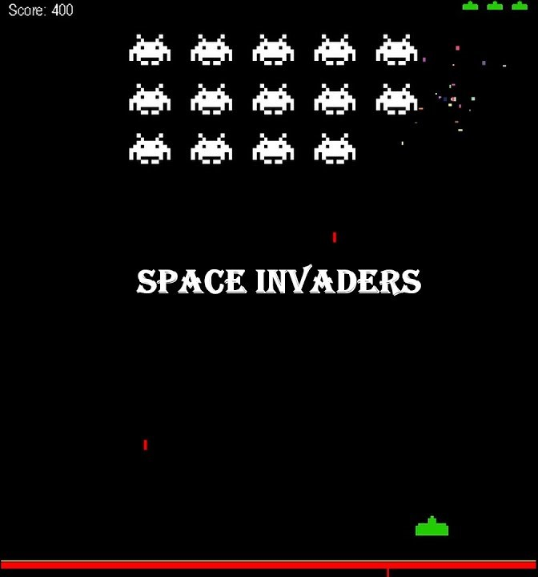
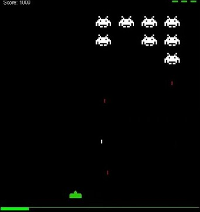

# 使用 Python 實現 太空侵略者遊戲
# Python Space Invaders game

運用 Python 語言實現太空侵略者遊戲。

> 2024/05/04 啟用維護，參見[日誌](#日誌)。

- #### 範例圖片
<div align = "center"></div>
<div align = "center"></div>

- #### 範例影片
    - [使用 Python 語言實作「太空侵略者 Space Invaders」 遊戲專題講解](https://youtu.be/Uan-lrejMio)
    - [使用 Python 語言實作「太空侵略者 Space Invaders」 遊戲片段](https://youtu.be/fsHSoYivJeo)
    - [Using Python language to implement the "Space Invaders" game clip](https://youtu.be/ivpsa0tO7Os)

---

## 目錄
- [目錄](#目錄)
- [開發環境](#開發環境)
- [如何執行](#如何執行)
- [版本差異](#版本差異)
- [日誌](#日誌)
- [貢獻](#貢獻)
- [著作權](#著作權)

---

## 開發環境

- Windows Home 10 64bit
- VScode
- Python `3.7.0`
- pygame

---

## 如何執行

> 預設 ***Windows Home 10 64bit*** 作業系統  

步驟 一：下載 `pygame` 。  

步驟 二：執行。  

- 方法一：直接點兩下執行 `analysis.py`  
>
- 方法二： 

```bash
cd Python-space-invaders
```
```bash
python game.py
```
---

## 版本差異

| 版本 | 描述 |
| :--: | ---- |
| v1.0 | 現階段已完成。 |

---

## 日誌

| 時間 | 事件 |
| :--: | ---- |
| 2024/05/04 | 資料救援回復 **2022** 編輯紀錄，重新開始維護！ |

---

## 貢獻

台大資訊之芽，期中大作業，作業完成品。 

---

## 著作權

此專案受到 [GPL-3.0](https://www.gnu.org/licenses/gpl-3.0.zh-tw.html) 保障。  
Copyright © 2022-2024 zong zong ( zongzong0408 )
